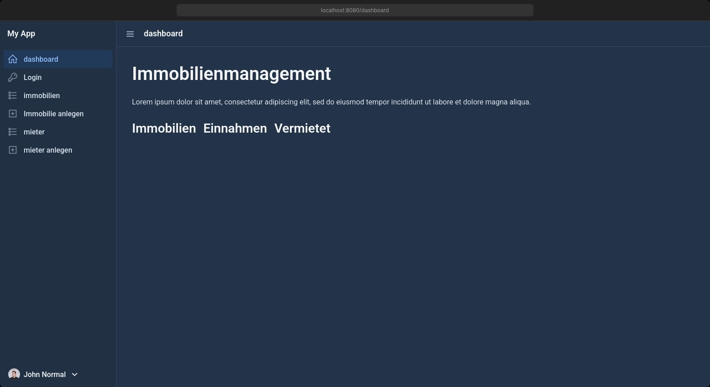
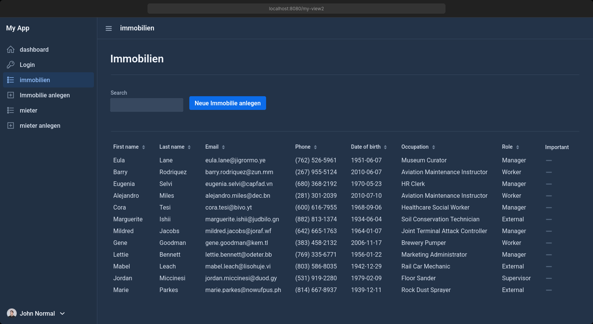
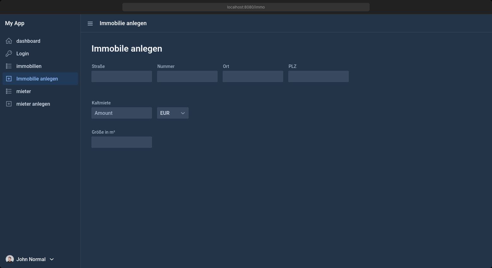
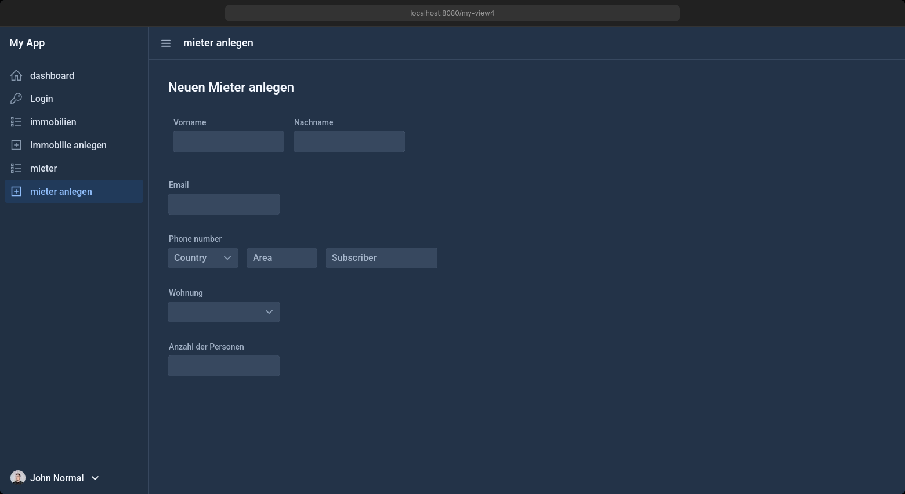
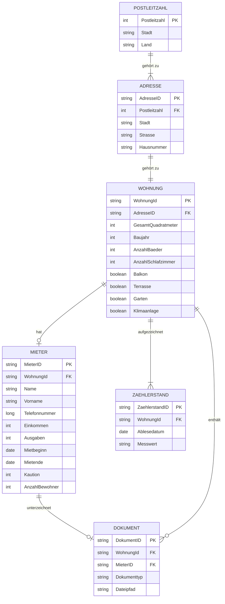

_Erstellt mit DALL-E_

# Immobilienverwaltung

Diese Anwendung ermöglicht die Verwaltung von Immobilien und deren Mietern.

---

> ⚠️ **Warnung**
>
> Under heavy development

    

## Inhaltsverzeichnis

- [Frameworks](#frameworks)
- [Funktionen](#funktionen)
  - [Grundfunktionalität](#grundfunktionalität)
  - [Priorität 2](#priorität-2)
  - [Priorität 3](#priorität-3)
- [Planung](#planung)
- [Erste Schritte](#erste-schritte)
- [Mockups](#mockups)
- [Database](#database)

## Frameworks

- **Java 21**
- **Backend**: Spring Boot
  - **Komponenten**: Includes Spring Data JPA, Spring Web, and Spring Security.
- **Database**: H2, PostgreSQL
  - H2 zur Entwicklung, fürs deployment wahlweise Postgres/MySQL
- **Frontend**: Vaadin
  - **Details**: Enables the development of reactive user interfaces entirely in Java.
- **Build-Tool**: Maven
  - **Nutzung**: Manages dependencies and simplifies the build process.
- **Tests**: JUnit
- **Deployment**: Docker

## Funktionen

### Grundfunktionalität

- **Immobilienverwaltung**: Erstellen, Ansehen und Verwalten von Immobiliendetails und -zusammenfassungen.
  - Adresse
  - Immobilientyp
  - Fotos / Dokumente
  - Anzahl der Häuser/Wohnungen
  - Namen zuweisen
  - Quadratmeter
  - Stockwerk
- **Mieterverwaltung**: Einrichten von Mietverhältnissen.
  - Telefonnummer
  - Einnahmen/Ausgaben
  - Verträge erstellen
  - Zählerstände
  - Dokumente
  - Vertragserstellung (Übergabeprotokoll usw.)
- **Dashboard**:
  - Anzahl der Immobilien
  - Einnahmen

### Priorität 2

- Dauer des Mietverhältnisses, Benachrichtigung bei Beendigung
- Benutzerrollen: Admin/Benutzer/Verwalter
- Mietdetails:
  - Karte mit Standort der Immobilie anzeigen

### Priorität 3

- Erstellung eines Exposés aus den Informationen als PDF
- Automatisches Erstellen von Mietverträgen mit Mieterdaten
- E-Mail-Support
- Such- und Filterfunktionen

## Planung

### Erste Schritte

#### Schritt 1: Definition des Projektumfangs und der Anforderungen

- [x] **Anforderungen sammeln**: Zusammenarbeit mit Stakeholdern (Immobilienverwalter, Makler usw.), um detaillierte
      funktionale und nicht-funktionale Anforderungen zu definieren.
- [x] **Projektumfang definieren**: Den Projektumfang klar abgrenzen, um Feature-Creep zu vermeiden und sicherzustellen,
      dass alle Beteiligten die gleichen Erwartungen haben.

#### Schritt 2: Entwicklungsumgebung einrichten

- [x] **Werkzeuge installieren**: Sicherstellen, dass alle Entwickler Java, IDE (wie IntelliJ IDEA oder Eclipse) und
      notwendige Plugins/Tools (für Vaadin, Spring usw.) installiert haben.
- [x] **Versionskontrolle einrichten**: Ein Git-Repository initialisieren und Strategien für das Branch-Management
      definieren (z.B. Git Flow).

#### Schritt 3: Systemarchitektur entwerfen

- [x] **Architektur definieren**: Entscheidung über die Anwendungsarchitektur (z.B. geschichtete Architektur,
      Microservices) basierend auf den Projektanforderungen.
- [x] **Technologiestapel wählen**: Auswahl für Backend, Frontend, Datenbank und andere Dienste wie Nachrichtenbroker
      oder externe APIs bestätigen.

#### Schritt 4: Beginnen mit dem Datenmodell

- [x] **Entity-Definition**: Definition von Entity-Klassen, die Geschäftsobjekte wie `Eigentum`, `Mieter`
      und `Mietvertrag` widerspiegeln.
- [x] **Beziehungsmapping**: Kartierung der Beziehungen zwischen Entitäten (z.B. eins-zu-viele zwischen `Eigentum`
      und `Mietvertrag`).

#### Schritt 5: Repositories einrichten

- [ ] **Repository-Schnittstellen erstellen**: Entwicklung von Schnittstellen für Ihre Repositories mit Spring Data JPA,
      um alle Datenbankoperationen zu abstrahieren und zu kapseln.
- [ ] **Benutzerdefinierte Abfragen definieren**: Bei Bedarf benutzerdefinierte Abfragen mit den Abfragemethoden von
      Spring Data JPA oder der Annotation @Query definieren.

#### Schritt 6: Geschäftslogik entwickeln (Service Layer)

- [ ] **Service-Implementierung**: Entwicklung von Service-Klassen, die Geschäftslogik enthalten und mit Repositories
      interagieren, um Daten zu abzurufen und zu manipulieren.
- [ ] **Service-API definieren**: Klar definieren, welche Geschäftsoperationen Ihre Service-Schicht anderen Teilen der
      Anwendung anbietet.

#### Schritt 7: Sicherheit implementieren

- [ ] **Spring Security konfigurieren**: Einrichten von Authentifizierung (z.B. JWT, OAuth2) und
      Autorisierungsmechanismen, um Ihre Anwendung zu sichern.
- [ ] **Benutzerrollen und Berechtigungen**: Definition unterschiedlicher Rollen (z.B. Admin, Benutzer, Verwalter) und
      Konfiguration von Zugriffskontrollen basierend auf diesen Rollen.

#### Schritt 8: Vaadin-Ansichten erstellen

- [ ] **UI-Design**: Skizzieren oder Prototypen des UI-Designs (Erwägung der Verwendung von Tools wie Figma oder Adobe
      XD für Mockups).
- [ ] **Vaadin-Komponenten entwickeln**: Entwicklung responsiver UI-Komponenten mit Vaadin, die sicherstellen, dass sie
      mit den Backend-Services verbunden sind.

#### Schritt 9: Testing

- [ ] **Unit Testing**: Schreiben von Unit-Tests sowohl für das Backend (Services, Repositories) als auch für
      Frontend-Komponenten.
- [ ] **Integrationstests**: Entwicklung von Integrationstests, die kritische Workflows und Interaktionen zwischen
      Komponenten abdecken.

#### Schritt 10: Bereitstellungsvorbereitung

- [ ] **Dockerisierung**: Containerisierung Ihrer Anwendung mit Docker zur einfachen Bereitstellung und Skalierung.
- [ ] **Continuous Integration einrichten**: Konfigurieren von CI-Pipelines (mit Jenkins, GitHub Actions usw.) für
      automatisiertes Testing und Deployment.

#### Schritt 11: Start und iterative Verbesserung

- [ ] **In Produktion gehen**: Verwenden eines Dienstes wie AWS, Azure oder DigitalOcean für die Bereitstellung.
- [ ] **Überwachung und Optimierung**: Implementierung von Überwachungstools zur Leistungs- und Nutzungskontrolle.
- [ ] **Feedback-Schleife**: Einrichten eines Prozesses zur Sammlung von Nutzerfeedback und zur kontinuierlichen
      Verbesserung der Anwendung basierend auf diesem Feedback.

### Mockups

Click to expand for Screenshots

    
     Dashboard

    
     Immo Management

    
     Neu Hinzufügen

    
     Miete Hinzufügen

    
     Neu Hinzufügen

## Database Design

Click to expand for Database Design

## Lizenz

Dieses Projekt ist unter der MIT-Lizenz lizenziert - Details finden Sie in der LICENSE-Datei.
