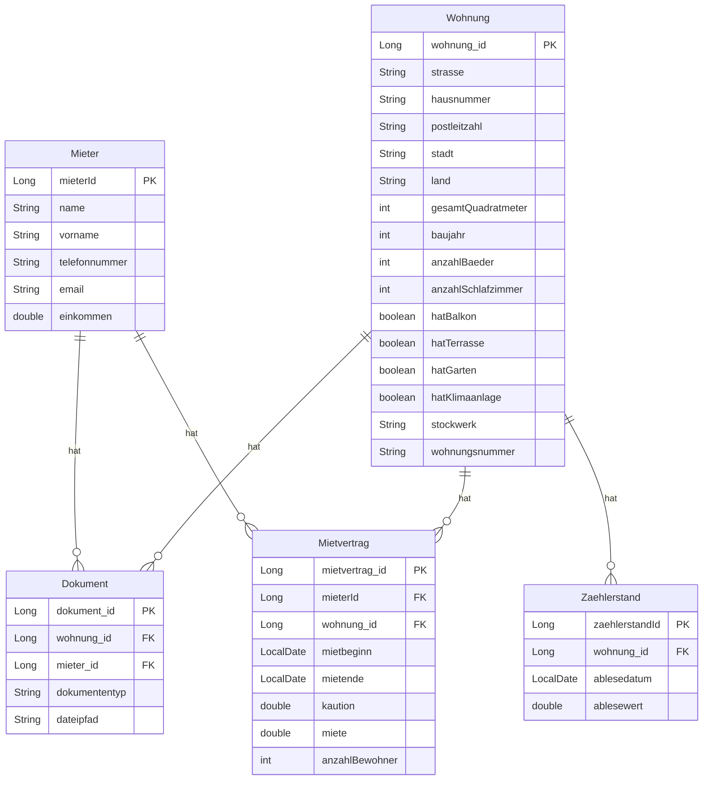

<em>Erstellt mit DALL-E</em>

# Immobilienverwaltung

Diese Anwendung ermöglicht die Verwaltung von Immobilien und deren Mietern.

---

> ⚠️ **Warnung**
>
> Under heavy development

    

## Inhaltsverzeichnis

- [Frameworks](#frameworks)
- [Funktionen](#funktionen)
- [Install](#install)
- [Mockups](#mockups)
- [Database](#database)
- [Dev Setup](#dev_setup)

## Frameworks

- **Java 21**
- **Backend**: Spring Boot
  - **Komponenten**: Spring Data JPA, Spring Web, Spring Dev Tools, und Spring Security
- **Database**: H2, PostgreSQL
  - H2 zur Entwicklung, fürs deployment Postgres
- **Frontend**: Vaadin
- **Build-Tool**: Maven
- **Tests**: JUnit
- **Deployment**: Docker

## Funktionen

#### 1. Mieter-Verwaltung

Die Mieter-Verwaltung ermöglicht es, Mieter zu erstellen, zu aktualisieren und zu löschen. Jeder Mieter hat mehrere Attribute, darunter Name, Vorname, Telefonnummer, E-Mail und Einkommen. Diese Attribute unterliegen strikten Validierungsregeln:

- Name und Vorname: Dürfen nur Buchstaben und Leerzeichen enthalten und müssen zwischen 1 und 100 Zeichen lang sein.
- Telefonnummer: Muss zwischen 6 und 12 Ziffern enthalten.
- E-Mail: Muss ein gültiges E-Mail-Format haben und eindeutig sein.
- Einkommen: Muss ein positiver Wert sein.

Zusätzlich können Mietern Dokumente und Mietverträge zugeordnet werden.
#### 2. Mietvertrag-Verwaltung

Mietverträge verknüpfen Mieter mit Wohnungen und enthalten Informationen wie Mietbeginn, Mietende, Miete, Kaution und die Anzahl der Bewohner. Die Validierungen stellen sicher, dass:

- Mietbeginn: Nicht in der Zukunft liegt.
- Mietende: Nach dem Mietbeginn liegt, falls gesetzt.
- Miete und Kaution: Positive Werte sind.
- Anzahl der Bewohner: Mindestens 1 beträgt.

Mietverträge können erstellt, aktualisiert und gelöscht werden, wobei die Beziehungen zu Mietern und Wohnungen berücksichtigt werden.
#### 3. Wohnung-Verwaltung

Wohnungen werden mit verschiedenen Attributen verwaltet, darunter Straße, Hausnummer, Postleitzahl, Stadt, Land, Gesamtquadratmeter, Baujahr, Anzahl der Bäder, Schlafzimmer sowie Ausstattungsmerkmale wie Balkon, Terrasse, Garten und Klimaanlage. Die Validierungen umfassen:

- Straße, Hausnummer, Stadt: Dürfen nicht leer sein und müssen bestimmten Mustern entsprechen.
- Postleitzahl: Muss zwischen 4 und 10 Ziffern enthalten.
- Gesamtquadratmeter: Muss mindestens 1 betragen.
- Baujahr: Muss eine vierstellige Jahreszahl sein und darf nicht in der Zukunft liegen.
- Anzahl der Bäder: Muss positiv sein.
- Anzahl der Schlafzimmer: Muss null oder positiv sein.

Wohnungen können ebenfalls Dokumente und Zählerstände zugeordnet werden.
#### 4. Dokumenten-Verwaltung

Dokumente können Mietern oder Wohnungen zugeordnet werden und enthalten Attribute wie Dokumenttyp und Dateipfad. Beide Felder dürfen nicht leer sein und müssen bestimmten Validierungen entsprechen.
#### 5. Zählerstand-Verwaltung

Zählerstände sind Wohnungen zugeordnet und enthalten das Ablesedatum und den Ablesewert. Beide Felder müssen gesetzt sein, wobei der Ablesewert positiv sein muss.
Beziehungen und Integrität

Die Anwendung stellt sicher, dass die Beziehungen zwischen Mietern, Mietverträgen, Wohnungen, Dokumenten und Zählerständen korrekt gehandhabt werden. Durch die Nutzung von Foreign Keys und spezifischen Validierungen wird die Datenintegrität gewährleistet. Beispielsweise:

- Ein Mietvertrag muss einem existierenden Mieter und einer existierenden Wohnung zugeordnet sein.
- Dokumente können entweder Mietern oder Wohnungen zugeordnet sein, nicht jedoch beiden gleichzeitig.

## Install

**Voraussetzungen:**
- Docker & Docker Compose muss [installiert](https://docs.docker.com/engine/install/) sein
- dann die [Docker compose](docker-compose.yml) herunterladen und anpassen
- dann `docker compose up -d`

### Mockups

Click to expand for Screenshots

    
     Dashboard

    
     Immo Management

    
     Neu Hinzufügen

    
     Miete Hinzufügen

    
     Neu Hinzufügen

## Database

Click to expand for Database Design

## dev Setup

**Voraussetzungen:**

- Java 21
- Git
- Maven bzw. Intellij installiert alles andere

**Setup:** Run/Debug Configuration:

1. Spring Boot auswählen
2. Modify Options: Add VM Options
3. Dort `-Dspring.profiles.active=dev` eingeben, um das Entwicklungsprofil auszuwählen
4. Modify Options: Add Environment Variable
5. Dort `demo_mode=true` eingeben, dass die Demodaten geladen werden

**Setup:** Database Connection

- Automatisch: Intellij schlägt die Verbindung vor: Nur die H2 verbinden, config wird automatisch übernommen. Die Postgres mit `-` heraus löschen
- Manuell: Auf der rechten Seite unter dem Database reiter die Verbindung zur H2 manuell hinzufügen.