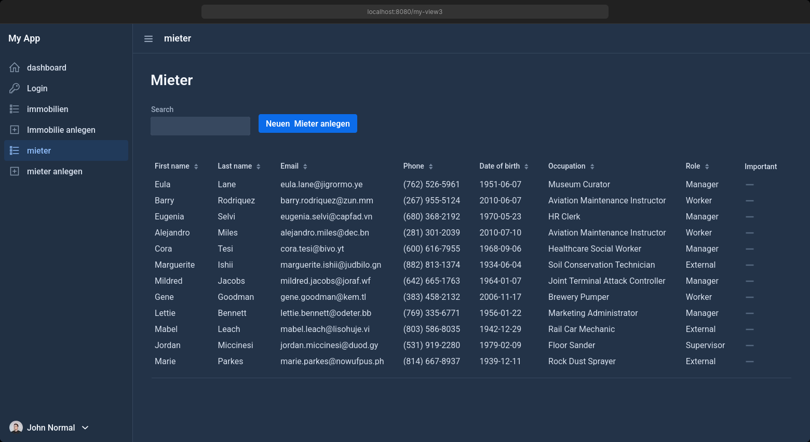

<em>Erstellt mit DALL-E</em>

# Immobilienverwaltung

Diese Anwendung ermöglicht die Verwaltung von Immobilien und deren Mietern.

---

> ⚠️ **Warnung**
>
> Under heavy development

    

## Inhaltsverzeichnis

- [Frameworks](#frameworks)
- [Funktionen](#funktionen)
  - [Grundfunktionalität](#grundfunktionalität)
  - [Priorität 2](#priorität-2)
  - [Priorität 3](#priorität-3)
- [Install](#install)
- [Mockups](#mockups)
- [Database](#database)
- [Dev Setup](#dev_setup)

## Frameworks

- **Java 21**
- **Backend**: Spring Boot
  - **Komponenten**: Spring Data JPA, Spring Web, Spring Dev Tools, und Spring Security
- **Database**: H2, PostgreSQL
  - H2 zur Entwicklung, fürs deployment Postgres
- **Frontend**: Vaadin
- **Build-Tool**: Maven
- **Tests**: JUnit
- **Deployment**: Docker

## Funktionen

### [x] Grundfunktionalität

- **Immobilienverwaltung**: Erstellen, Ansehen und Verwalten von Immobiliendetails und -zusammenfassungen.
  - Adresse
  - Immobilientyp
  - Fotos / Dokumente
  - Anzahl der Häuser/Wohnungen
  - Namen zuweisen
  - Quadratmeter
  - Stockwerk
- **Mieterverwaltung**: Einrichten von Mietverhältnissen.
  - Telefonnummer
  - Einnahmen/Ausgaben
  - Verträge erstellen
  - Zählerstände
  - Dokumente
  - Vertragserstellung (Übergabeprotokoll usw.)
- **Dashboard**:
  - Anzahl der Immobilien
  - Einnahmen
- Such- und Filterfunktionen

### [ ] Priorität 2

- Dauer des Mietverhältnisses, Benachrichtigung bei Beendigung
- Benutzerrollen: Admin/Benutzer/Verwalter
- Mietdetails:
  - Karte mit Standort der Immobilie anzeigen

### [ ] Priorität 3

- Erstellung eines Exposés aus den Informationen als PDF
- Automatisches Erstellen von Mietverträgen mit Mieterdaten
- E-Mail-Support

## Install

**Voraussetzungen:**
- Docker & Docker Compose muss [installiert](https://docs.docker.com/engine/install/) sein
- dann die [Docker compose](docker-compose.yml) herunterladen und anpassen
- dann `docker compose up -d`

### Mockups

Click to expand for Screenshots

    
     Dashboard

    
     Immo Management

    
     Neu Hinzufügen

    
     Miete Hinzufügen

    
     Neu Hinzufügen

## Database

Click to expand for Database Design

## dev Setup

**Voraussetzungen:**

- Java 21
- Git
- Maven bzw. Intellij installiert alles andere

**Setup:** Run/Debug Configuration:

1. Spring Boot auswählen
2. Modify Options: Add VM Options
3. Dort `-Dspring.profiles.active=dev` eingeben, um das Entwicklungsprofil auszuwählen
4. Modify Options: Add Environment Variable
5. Dort `demo_mode=true` eingeben, dass die Demodaten geladen werden

**Setup:** Database Connection

- Automatisch: Intellij schlägt die Verbindung vor: Nur die H2 verbinden, config wird automatisch übernommen. Die Postgres mit `-` heraus löschen
- Manuell: Auf der rechten Seite unter dem Database reiter die Verbindung zur H2 manuell hinzufügen.