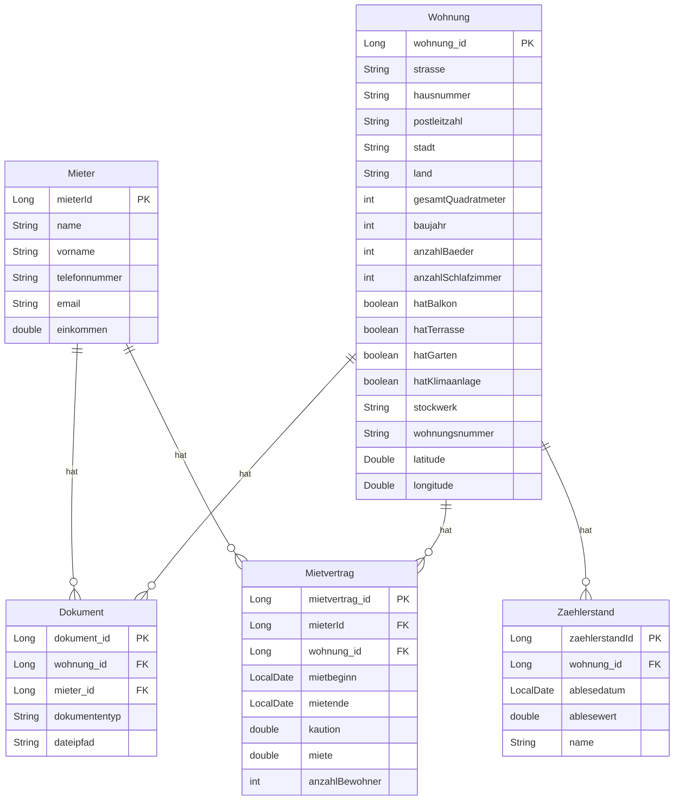

```mermaid
erDiagram
    Mieter {
        Long mieterId PK
        String name
        String vorname
        String telefonnummer
        String email
        double einkommen
    }
    Mietvertrag {
        Long mietvertrag_id PK
        Long mieterId FK
        Long wohnung_id FK
        LocalDate mietbeginn
        LocalDate mietende
        double kaution
        double miete
        int anzahlBewohner
    }
    Wohnung {
        Long wohnung_id PK
        String strasse
        String hausnummer
        String postleitzahl
        String stadt
        String land
        int gesamtQuadratmeter
        int baujahr
        int anzahlBaeder
        int anzahlSchlafzimmer
        boolean hatBalkon
        boolean hatTerrasse
        boolean hatGarten
        boolean hatKlimaanlage
        String stockwerk
        String wohnungsnummer
        Double latitude
        Double longitude
    }
    Dokument {
        Long dokument_id PK
        Long wohnung_id FK
        Long mieter_id FK
        String dokumententyp
        String dateipfad
    }
    Zaehlerstand {
        Long zaehlerstandId PK
        Long wohnung_id FK
        LocalDate ablesedatum
        double ablesewert
        String name
    }

    Mieter ||--o{ Dokument: "hat"
    Mieter ||--o{ Mietvertrag: "hat"
    Wohnung ||--o{ Mietvertrag: "hat"
    Wohnung ||--o{ Dokument: "hat"
    Wohnung ||--o{ Zaehlerstand: "hat"
```