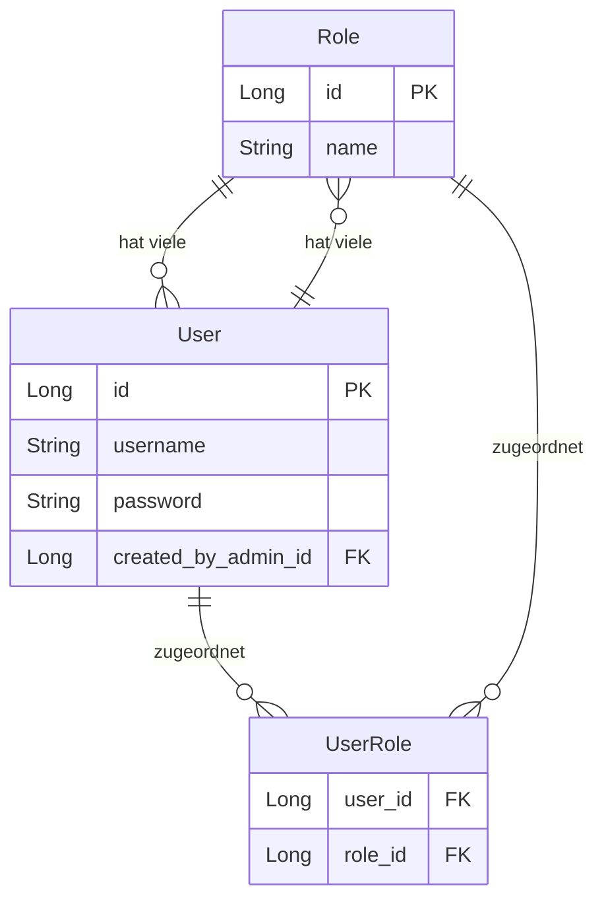

```mermaid
erDiagram
    Role {
        Long id PK
        String name
    }
    User {
        Long id PK
        String username
        String password
        Long created_by_admin_id FK
    }
    UserRole {
        Long user_id FK
        Long role_id FK
    }
    User ||--o{ Role : "hat viele"
    Role ||--o{ User : "hat viele"
    User ||--o{ UserRole : "zugeordnet"
    Role ||--o{ UserRole : "zugeordnet"
```